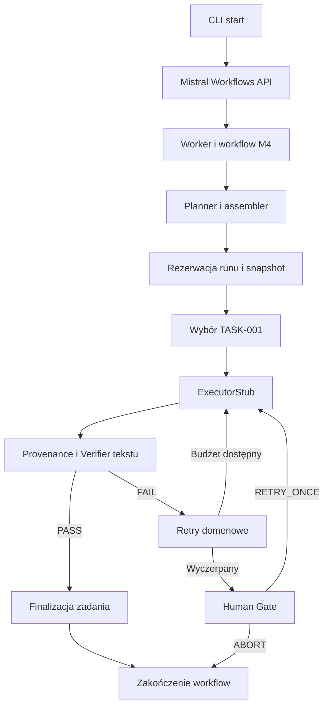

# FS-ASM v1 — audyt zgodności architektury i plan migracji

**Data przeglądu: 17 września 2026, UTC.** Stan branchy i PR ponownie odczytany podczas zamykania analizy. Repozytorium: [bmateuszideas/fsasm-training-lab](https://github.com/bmateuszideas/fsasm-training-lab).

**Charakter dokumentu:** niezależna analiza i propozycja kolejki prac do akceptacji w projekcie ChatGPT FS-ASM. Nie jest akceptacją M4, rozpoczęciem M5 ani poleceniem wykonania zmian. Nie zmieniono kodu ani plików śledzonych w repozytorium; nie utworzono commitów ani PR-ów, niczego nie scalono i nie zlecono implementacji agentom.

## 1. Rzeczywisty stan projektu i badane SHA

| Obiekt | Zweryfikowany stan | SHA |
|---|---|---|
| `Fsasm-experimental` | Istnieje; branch integracyjny, po scaleniu PR #19 | `267795eaffce209583a111ea59fdc5192521d432` |
| `main` | Istnieje; starsza linia, nie odzwierciedla wszystkich stabilizacji integracji | `a9f8ab6640acfda21c31675a03ba53d094f2909f` |
| `task/m4-stabilization-batch` | Istnieje; kandydat stabilizacyjny badany najdokładniej | `142db38079d2e15c4c65a4a3c9481bb4cdab81fd` |
| [PR #20](https://github.com/bmateuszideas/fsasm-training-lab/pull/20) | **OPEN**, nie draft, **nie scalony**; head: powyższy branch zadaniowy, base: `Fsasm-experimental` | head `142db38079d2e15c4c65a4a3c9481bb4cdab81fd`, base `267795eaffce209583a111ea59fdc5192521d432` |

PR #20 obejmuje 10 commitów, 23 pliki, +5060/−74 linie. Ostatnia aktualizacja metadanych: `2026-09-17T01:32:05Z`. GitHub zwrócił `mergeable=true`; oznacza to możliwość technicznego scalenia, nie poprawność ani akceptację. Pole `merge_commit_sha` przy otwartym PR nie dowodzi scalenia. [Źródło stanu PR](https://github.com/bmateuszideas/fsasm-training-lab/pull/20), [źródło branchy](https://api.github.com/repos/bmateuszideas/fsasm-training-lab/branches?per_page=100).

### 1.1. Ocena końcowa

**Projekt ma wartościowy, działający demonstrator kontrolowanego wykonania pojedynczego zadania ze stubem, persystencją i Human Gate. Nie ma jeszcze kompletnego runtime’u zgodnego z v1.** Brakuje przede wszystkim wykonania całego planu, rzeczywistych operacji narzędziowych, niezależnej weryfikacji artefaktów, agentowej pętli Executora, Model Gateway i adaptera lokalnego. M4 nie może zostać uznane za pełny runtime na podstawie zielonego zestawu testów.

PR #20 poprawia realne problemy: rezerwację tożsamości runu, wybór autorytatywnego snapshotu, odtwarzanie projekcji planu i część protokołu Human Gate. Nie należy odrzucać całego tego dorobku. Jednocześnie pozostają odtwarzalne problemy z audytem odrzuceń i przyjmowaniem decyzji pozbawionych tożsamości konkretnej bramki. Zalecenie: **ograniczona korekta PR #20 i ponowny review, następnie migracja etapami; bez automatycznego zamykania M4**.

Najważniejsze ustalenia:

1. `state.json` jest już preferowanym autorytetem przy odczycie planu na kandydacie. Nie jest prawdą, że obecny `plan.json` ma zawsze równorzędną władzę. Nadal jednak brakuje `revision`, kompletnego Task Register, referencji do zaakceptowanych evidence i jednego punktu zmiany stanu.
2. M4 wykonuje wyłącznie `TASK-001`. Sukces workflow nie oznacza ukończenia całego planu; pozostałe zadania pozostają `PENDING`.
3. `ExecutorStub` potrafi zwrócić oczekiwany tekst z `VerificationSpec`; Verifier szuka tego tekstu w evidence pochodzącym z odpowiedzi stuba. To demonstracja kontraktu, nie dowód wykonania pracy.
4. Wersja Workflows użyta w badanym środowisku to **3.9.0**. Standardowy start i worker korzystają z usług Mistral. Lokalny worker nie jest dowodem całkowicie lokalnej orkiestracji.
5. Złożoność koncentruje się wokół wielokrotnie przekazywanego i uzgadnianego stanu oraz czterech generacji workflow. Ograniczenie tej złożoności wymaga zmiany granic odpowiedzialności, a nie tylko następnych testów interleavingów.

### 1.2. Zakres dowodów i walidacja

**[FAKT — wykonane]** Kod kandydata analizowano przy detached HEAD `142db38…`; porównano go z obiema liniami repozytorium. W izolowanym środowisku zależności odtworzonym z `uv.lock` wykonano pełny pytest:

- **625 passed, 3 skipped**, 46,76 s; 7318 ostrzeżeń. Pominięte testy live nie stanowią dowodu działania API.
- `ruff check src/workflows/ src/fsasm/ tests/`: PASS.
- `mypy src/workflows/ src/fsasm/`: PASS; uwagi o domyślnym niesprawdzaniu ciał funkcji bez typowania nie oznaczają pełnej analizy wszystkich ścieżek.
- [GitHub Actions run 35170783225](https://github.com/bmateuszideas/fsasm-training-lab/actions/runs/35170783225): `success`, powiązany z kandydatem `142db38…`. Dla zdarzenia `pull_request` checkout CI może dotyczyć syntetycznego merge ref; lokalny pytest wykonano dokładnie na head kandydata.

Nie uruchamiano rzeczywistych modeli, płatnych wywołań modelowych ani runtime’u na komputerze użytkownika. Nie deklaruję osobnego lokalnego wykonania całego `make check`; źródłem tej deklaracji w PR jest autor i CI. Zestawów `main` i `Fsasm-experimental` nie uruchamiano ponownie w całości — porównano kod, historię i zmiany. Dodatkowe niewielkie próby komponentowe opisano w §4.2; nie były zmianami testów repozytorium.

### 1.3. Co rzeczywiście zmieniło się od wcześniejszych audytów

`main` zachowuje starszy kod `src/fsasm`/workflow; porównanie z historycznym `c47f35602d812122fa40320a144880306cf7851d` nie wykazało zmian w badanej części źródłowej. Nie należy przenosić tej obserwacji na całe repozytorium, które zawiera też dokumentację i inne prace.

Integracja zawiera już poprawki po audycie z 9 września, m.in. ochrony finalizacji F8 i ścieżek F5. PR #20 dodaje kolejne zmiany F3/F4/Human Gate. Punkty historyczne istotne dla pochodzenia poprawek:

| Commit / obiekt | Znaczenie w analizie |
|---|---|
| `32cd58346b4d8d71cc0216aa54a341992508dd39`, merge `dbc73b74905064b5586325c207d70d5b7685aa19` | Linia poprawek F8; nie wolno opisywać starego finalizera tak, jakby nadal nie miał strażników |
| `eb2033b5a876a850ba7a6d58d66673201b0c4c53`, merge #19 `267795e…` | Linia ochron F5 obecna na integracji |
| `19783de`, `d8f0ea7` | W PR #20: odpowiednio snapshot/odzyskiwanie i rezerwacja runu |
| `094b6de`, `3637d43`, `142db38` | Kolejne korekty authority/Human Gate; ostatni commit jest badanym kandydatem, nie samodzielnym dowodem zamknięcia usterek |

Pełny diff PR należy oceniać względem `267795e…`, a nie tylko według ostatniego commita czy sekcji „Changed files” w opisie correction-pass 3.

## 2. Hierarchia wykorzystanych źródeł

### 2.1. Jedyny normatywny dokument architektury

**`FSASM_ARCHITEKTURA_RUNTIME_V1_ZATWIERDZONA_2026-09-17(1).md`** — lokalna kopia wskazanego przez użytkownika zatwierdzonego dokumentu. Dostęp udało się uzyskać mimo sprzecznego komunikatu o załączniku we wcześniejszej wiadomości. Przeczytano całość: 671 linii, włącznie z częściami XIX i XX. Sufiks `(1)` jest nazwą kopii, nie alternatywną architekturą.

SHA-256 odczytanego pliku: `56aeeb60c8c700c71dc3d395659127afbf511e1726e0ffd76270c848fd764808`.

Odniesienia „v1 §…” w raporcie oznaczają numerowane rozdziały tego dokumentu. Nazwy nowych plików i kontraktów proponowane dalej są projektem wykonawczym; nie zastępują zatwierdzonych decyzji.

### 2.2. Kolejność rozstrzygania rozbieżności

| Poziom | Źródło | Zastosowanie |
|---|---|---|
| 1 | Zatwierdzona architektura v1 oraz bieżące instrukcje użytkownika | Docelowy podział odpowiedzialności, ograniczenia i organizacja pracy |
| 2 | Kod na dokładnych SHA, lockfile, konfiguracja; wykonane próby | Ustalenie tego, co obecnie działa; kod nie ustanawia nowej architektury |
| 3 | Oficjalna dokumentacja Workflows i kod zainstalowanego SDK 3.9.0 | Weryfikacja technicznych możliwości i ograniczeń dostawcy |
| 4 | `CURRENT_FSASM_MODEL(1).md`, review z 16 września, audyty z 9 września | Historia kontraktów, usterek i uzasadnień; nie nadpisują v1 |
| 5 | Rozmowy historyczne, ZIP, README, opisy PR i statusy | Kontekst i wskazówki do sprawdzenia, nie samodzielny dowód funkcji |

Przejrzano `CURRENT_FSASM_MODEL(1).md`, `FSASM_REVIEW_main_i_Fsasm-experimental_2026-09-16.md` oraz oba załączniki audytu z 9 września. Kopie audytu `(1)` i `(2)` mają ten sam SHA-256 `98eb5c9e4bad901e1770cbdb2c6714211fb31ce287e7956f082cec7e241b24f9`; nie są dwiema niezależnymi opiniami.

Historyczne `FS_ASM_Orkiestrator_Agentowy.txt` i `Wyja_nij_agenta_AI.md` wykorzystano poprzez lekturę fragmentów dotyczących genezy, zewnętrznego stanu, przejmowania zadań i lokalnego modelu. Nie deklaruję pełnej lektury obu długich zapisów rozmów. Załączone `fsasm-first.zip` potraktowano jako materiał historyczny; aktualność ustalano z GitHub, nie z ZIP. Wcześniejsze propozycje fine-tuningu, LLMC lub organizacji wielu modeli nie otrzymują przez to statusu wymagań v1.

### 2.3. Oznaczenia w raporcie

- **FAKT / KOD** — obserwacja kodu, konfiguracji lub odczytanego stanu GitHub.
- **PRÓBA** — wynik wykonanej próby ze wskazanym zakresem; nie jest domyślnie testem całego wdrożenia.
- **WNIOSEK** — ocena architektoniczna na podstawie faktów.
- **PROPOZYCJA** — zmiana do akceptacji, której nie wykonano.
- **NIEWYJAŚNIONE** — brak dostatecznego dowodu, szczególnie dla produkcyjnego wdrożenia usług.

Wszystkie odsyłacze C01–C19 w dalszej części wskazują kod na **`142db38079d2e15c4c65a4a3c9481bb4cdab81fd`**, chyba że zaznaczono inaczej. Pełny rejestr linków znajduje się na końcu.

## 3. Aktualna architektura wynikająca z kodu

### 3.1. Uruchomienie i rzeczywista ścieżka M4

`src/entrypoints/start.py` przyjmuje nazwę workflow i JSON, wymaga `MISTRAL_API_KEY`, tworzy klienta domyślnie dla `https://api.mistral.ai` i wywołuje `execute_workflow_and_wait_async`. `src/worker.py` odkrywa workflow i uruchamia worker SDK. Domyślną nazwą entrypointu pozostaje `hello-world`, a nie docelowy runtime FS-ASM. [C01], [C02]



To diagram obecnego kandydata, nie schemat docelowej architektury. Historię techniczną prowadzi Workflows; stan domeny i evidence są plikami zapisywanymi przez activities.

Kolejność w `FsasmMilestoneFourWorkflow.run`:

1. Walidacja konfiguracji/wejścia, Planner, przypisanie limitu prób i utworzenie runu. Planner jest wywoływany przed ostateczną rezerwacją tożsamości; kolizja ID może zostać wykryta dopiero po pracy planera.
2. `find_next_ready_task_activity` wybiera wyłącznie `TASK-001`. Nazwa i opis sugerujące scheduler zależności są szersze niż implementacja.
3. `prepare_task_activity` ustawia statusy, aktywne zadanie i licznik próby oraz zapisuje stan/plan.
4. `execute_task_activity` obsługuje tylko backend `STUB`. Następują sprawdzenie provenance, konwersja odpowiedzi na evidence i wywołanie Verifiera.
5. Przy PASS finalizer sprawdza część kontraktu i utrwala evidence oraz stan. Przy FAIL osobna activity zapisuje porażkę; retry wraca do tego samego zadania.
6. Po wyczerpaniu prób workflow rejestruje bramkę, zapisuje `NEEDS_HUMAN`, czeka na sygnał, stosuje decyzję i zamyka bramkę.
7. Workflow kończy się po obsłudze pierwszego zadania. Nie wraca do wyboru `TASK-002`/`TASK-003` i nie agreguje pełnego planu do końcowego PASS runu. [C03], [C07]

### 3.2. Moduły i odpowiedzialności faktyczne

| Moduł | Co robi dzisiaj | Granica działania |
|---|---|---|
| `src/fsasm/models.py` | Modele Pydantic, statusy, konfiguracje i rezultaty | Nie pełny model v1; enuma backendów nie realizuje adapterów |
| `planner.py::assemble_plan` | Z propozycji tworzy zaufane ID, początkowe statusy i zależności do wcześniejszych zadań | Dokładnie 3 zadania; `parent_id=None`; zakres plików pochodzi z propozycji |
| `planner_activities.py::plan_with_mistral` | Rzeczywiste pojedyncze wywołanie Mistral, JSON→walidacja→assembler, metadane promptu i użycia | Osobna integracja planera, nie współdzielony Model Gateway |
| `executor.py::ExecutorStub` | Kontrolowana symulacja FAIL/PASS tekstem | Brak modelu, narzędzi, obserwacji i zmian artefaktów |
| `executor_activities.py` | Przygotowanie zadania, stub, provenance, evidence, Verifier i finalizacja | Zawiera także reguły i zapisy domenowe; przekazuje mutowalne kopie stanu |
| `verifier.py::DeterministicVerifier` | Kontrole schematów/stanu i tekstu evidence | Nie czyta efektów pracy w workspace; brak rzeczywistych testów/checków artefaktu |
| `transitions.py` | Macierze i strażnicy przejść, próby, autoryzowane retry | Funkcje zmieniają przekazany model; nie jeden czysty reduktor całego snapshotu |
| `persistence.py::RuntimePersistence` | Walidacja ścieżek, rezerwacja runu, JSON/JSONL, odczyt autorytatywnego stanu i naprawa projekcji | Brak kontroli revision, operacyjnego resume i rejestru zaakceptowanych evidence |
| `fsasm_milestone_one/two/three/four.py` | Cztery kolejne demonstratory i powielane activities | Wszystkie pozostają utrzymywane; M4 ma 1850 linii |
| `src/examples`, `hello.py` | Przykłady SDK / szablon projektu | Ich istnienie nie dowodzi podłączenia funkcji do FS-ASM |

Źródła: [C03], [C04], [C05], [C06], [C07], [C08], [C09], [C10].

### 3.3. Gdzie znajduje się stan

Obecny stan jest rozłożony na różne reprezentacje o **różnych** gwarancjach:

| Reprezentacja | Rola faktyczna | Ryzyko |
|---|---|---|
| `state.json` z osadzonym planem | Autorytet przy odczycie na kandydacie | Brak revision, kompletności rejestru i scentralizowanej walidacji zmian |
| `plan.json` | Projekcja, naprawiana z `state.json`; fallback dla starszych, nierezerwowanych danych | Stare API `save_plan` nadal pozwala zapisywać osobno; trzeba zakończyć okres przejściowy |
| `RunState`, osobny `Plan`, `ChildTask` w argumentach activities | Kopie używane do obliczenia zmian | Ręczne uzgadnianie obiektów; możliwość zatwierdzenia nieaktualnej kopii |
| Pola workflow `current_gate`, decyzje, kursory, zbiory ID | Techniczna obsługa sygnałów i lokalna deduplikacja | Brak pełnego odzwierciedlenia semantycznej tożsamości bramki w snapshotcie |
| Historia Workflows | Ukończenia activities, sygnały, techniczne odtworzenie | Nie jest Task Register ani transakcją z lokalnym plikiem |
| Pliki evidence i log | Wyniki i diagnostyka | Odczyt wszystkich plików nie odróżnia dowodu zaakceptowanego od osieroconego |

`commit_run_state` najpierw zapisuje autorytatywny stan, potem plan. Błąd drugiego zapisu może oznaczać niepowodzenie activity mimo zatwierdzonego stanu. `recover_run` potrafi naprawić projekcję; nie rozwiązuje jednak powtórnego zastosowania operacji domenowej. `prepare_task_activity` i `finalize_task_activity` nadal używają bezpośrednich zapisów zamiast jednej pełnej ścieżki commit. [C07], [C08]

## 4. Macierz zgodności z zatwierdzoną architekturą v1

Ocena odnosi się do najlepszego dostępnego kandydata `142db38…`. Dla integracji bez PR #20 stan F3/F4/Human Gate jest wcześniejszy; nie należy przypisywać jej poprawek obecnych tylko w PR.

### 4.1. Pokrycie wymagań

| Obszar v1 | Stan | Dowód w implementacji | Luka i docelowy kierunek |
|---|---|---|---|
| Środowiska i role, §§4–5 | Organizacyjnie określone; pakiet jeszcze demonstracyjny | Worker/entrypoint są kodem runtime’u; Vibe nie jest obiektem agenta FS-ASM [C01], [C02] | Zachować rozdział: ChatGPT planuje/reviewuje, Vibe koduje, użytkownik uruchamia gotowy produkt |
| Workflows vs Domain Core, §§6–8 | Częściowe, z naruszeniem granicy | Osobne `fsasm`, ale M4 zawiera zmiany stanu, politykę retry i gate; activities przekazują state/plan/task [C03], [C07] | Workflows ma sterować techniczną sekwencją; semantyczna decyzja i commit w Domain Core |
| Project Memory / Run State / History, §9 | Częściowe | Pliki projektu, snapshot i historia istnieją jako różne nośniki | Brak Context Buildera korzystającego z pamięci projektu; historia nie zastępuje rejestru |
| Autorytatywny snapshot, §10 | Istotny postęp, niepełna zgodność | `load_plan` preferuje plan ze stanu, `recover_run` naprawia eksport [C08] | Dodać revision, zaakceptowane refs, gate/counters i walidację całego stanu; usunąć alternatywne mutatory |
| Jedna zmiana stanu, §11 | Brak wymaganego kontraktu | `commit_run_state(state)` bez `expected_revision`; wiele ręcznych mutacji [C07], [C08], [C10] | Czyste `apply_event`, jeden single-writer commit i jawny wynik powtórzenia/starej wersji |
| Evidence przed zaakceptowaniem, §12 | Częściowe | Finalizacja zapisuje evidence przed statusem [C07] | Snapshot nie wskazuje zaakceptowanych dowodów; dodać attempt/artifact identity i integralność refs |
| Pojedynczy host/writer, §13 | Założenie, nie pełna granica uruchomienia | Pliki lokalne i sekwencyjne M4; `create_run` rezerwuje ID [C08] | Udokumentować i egzekwować jednego writera; nie budować rozproszonej blokady ani deklarować multiwriter |
| `start_new` / `resume`, §14 | Start częściowy; resume brak | `create_run` odrzuca istniejący katalog; `recover_run` ładuje stan [C08] | Publiczne rozdzielne tryby; resume sprawdza checkpoint/evidence i relację do wykonania Workflows |
| Częściowy skutek, §15 | Niezaimplementowane dla rzeczywistych narzędzi | Stub nie powoduje skutków; brak rejestru operacji narzędziowych | Przed powtórzeniem rozstrzygać stan skutku; nie zapewniać fikcyjnego exactly-once |
| Intake i Planner, §16 | Planner działa; Intake minimalny | `GoalInput` głównie goal/run_id, Mistral Planner realny [C04], [C06] | Dodać zaufany zakres workspace/polityki; odseparować propozycję od uprawnień |
| Task Compiler, §16 | Częściowy | `assemble_plan` nadaje ID/statusy i sprawdza wcześniejsze dependencies [C05] | Dowolny plan w ustalonym limicie, walidacja DAG, polityki i zakres niepochodzące wyłącznie z LLM |
| Parent i Child, §17 | Child częściowy, Parent szkielet pola | `ChildTask.parent_id`, assembler zawsze `None`; brak agregatu Parent [C04], [C05] | Wprowadzić sensowną hierarchię i mierzalne ukończenie parent; nie same nazwy pól |
| Scheduler, §18 | Demonstrator sprzeczny z pełnym zakresem | `find_next_ready_task_activity`: tylko `TASK-001` [C03] | Wybierać wszystkie zadania spełniające zależności, jedno aktywne, wykrywać brak postępu i agregować run |
| Schematy, §19 | Częściowe | Pydantic dla planu, task, output, evidence [C04] | Brak pełnych kontraktów model/tool/observation/attempt/gate/revision; zlikwidować „dokładnie trzy” |
| Context Builder, §§20–21 | Brak | Brak ścieżki budującej task-scoped context | Kontekst z zatwierdzonego zadania, plików, ograniczeń i poprzedniej porażki; limity rozmiaru |
| Pętla Executora, §22 | Brak; stub | `ExecutorStub.execute` oddaje tekst oczekiwany lub kontrolowany błąd [C09] | Model→tool call→observation→model, do jawnego warunku zakończenia |
| Dwa poziomy retry i liczniki, §23 | Retry zadania częściowe | Attempt, max_attempts, M4 while; techniczne policies SDK [C03], [C04] | Osobne task_attempt, agent_step, model/tool calls; retry techniczne nie zużywa nowej próby merytorycznej |
| Wyniki/stopy Executora, §24 | Niepełne | Tekst + metadata i wynik Verifiera [C04], [C09] | Jawne outcome dla ukończenia, blokady, limitu, błędu modelu/narzędzia i eskalacji |
| Model Gateway, §25 | Brak | Planner wywołuje Mistral bez wspólnego kontraktu [C06] | Jeden provider-neutral kontrakt używany przez Planner/Executor; brak logiki wyboru w adapterze |
| Lokalny i Mistral A/B, §26 | Lokalny brak; Mistral tylko planer | Enum `LOCAL`/`MISTRAL`, lecz executor je odrzuca [C07] | Lokalny backend domyślny, dwa konfigurowane role API; konkretne nazwy modeli później |
| Tool Broker, §27 | Brak | Brak FS-ASM list/read/search/patch/checks/diff | Kontrolowane narzędzia na izolowanym workspace i obserwacje niezależne od odpowiedzi LLM |
| Egzekwowanie praw, §28 | Persystencja chroniona, broker nie istnieje | F5 waliduje ID/ścieżki danych runtime’u [C08], [C13] | F5 nie jest sandboxem narzędzi; egzekwować scope przed odczytem/zapisem i wykonaniem procesu |
| Niezależny Verifier, §29 | Nazwa istnieje, kluczowa funkcja nie | `verify_task_execution` szuka expected w `executor_output.result` [C11] | Czytać realny artefakt, uruchamiać zaufane checki; nie uznawać deklaracji modelu za dowód |
| Kontrakt PASS, §30 | Strażniki F8 wartościowe, niepełne v1 | Spójność run/task/status, niepuste checks/evidence, wszystkie checks PASS [C07], [C14] | Związać wynik z attempt i artefaktem, sprawdzić zaakceptowane refs; pełna agregacja rodzica/runu |
| Routing/eskalacja, §§31–32 | Brak | Wybór backendu konfiguracją, brak deterministycznego routera | Lokalnie domyślnie; consultation i handover jako różne zdarzenia; limit eskalacji |
| Human Gate, §33 | Działa w zakresie demonstratora, ma usterki | Sygnał, first-valid-wins, retry/abort, audit [C03] | Tożsamość run/task/gate/decision trwała; stara zgoda nie może obsłużyć nowej bramki |
| Obserwowalność i budżety, §§23,34 | Metadane/log częściowe; budżety agenta brak | Prompt hashes/usage planera, attempt, log/evidence [C04], [C06], [C08] | Liczniki model/tool/steps/czas/koszt i terminal reason; nie osobna platforma telemetryczna |
| Trajektorie/fine-tuning, §35 | Odłożenie zgodne | Brak wymogu treningu do działania stubów | Zachować użyteczne ślady; nie rozpoczynać fine-tuningu ani LLMC jako zależności v1 |
| Dostarczenie i integracja, §§36–37 | Szkielet pakietu, nie gotowy produkt | Python/uv, wheel, entrypoints [C01], [C15] | Powtarzalna instalacja, config/start/resume/status/signal, opis usług; potem test lokalnego 7B Q4 |
| Migracja i non-goals, §§38–43 | Wymaga nowego planu prac | Cztery milestones, statusy starszego kontraktu | Zachować zabezpieczenia, wycofać kopie etapami; bez przepisywania silnika, rozproszenia i automatycznego M5 |
| Mapa ustaleń i pochodzenie, XIX–XX | Źródło nadrzędne dostępne poza repo | Dokument v1 w załączniku; repo nadal odsyła do starszych materiałów | Po akceptacji kolejki uaktualnić instrukcje Vibe i hierarchię źródeł w repo |

### 4.2. Szczegółowe ustalenia wymagające reakcji

#### G1 — nieaktualny snapshot może nadpisać nowszy stan

**KOD:** `RuntimePersistence.commit_run_state` przyjmuje sam `RunState`; model nie posiada revision. Nie ma porównania oczekiwanej wersji z zapisanym stanem. [C08], [C04]

**PRÓBA komponentowa:** zapisano RUNNING, zachowano kopię, zapisano nowszy stan, następnie zatwierdzono starą kopię. Odczyt zwrócił znowu RUNNING. Nie wymagało to dwóch procesów ani równoległych writerów.

**WNIOSEK:** single-writer nie chroni przed nieaktualnym argumentem activity lub powtórzeniem po niejednoznacznym zakończeniu zapisu. To luka v1 §10–11, a nie dowód, że F3 niczego nie poprawiło. **PROPOZYCJA:** revision + zdarzenie domenowe + jeden commit, jawne rozpoznanie ponownego zastosowania już zatwierdzonej operacji. Nie dodawać osobnego event-sourcingu jako drugiego autorytetu.

#### G2 — pozorny PASS może pochodzić z odpowiedzi, także ze starej próby

**KOD:** `ExecutorStub.execute` pobiera `task.verification.expected` i używa jako poprawnej odpowiedzi. `convert_executor_output_to_evidence_activity` opakowuje tę odpowiedź w oczekiwane rodzaje evidence. `DeterministicVerifier.verify_task_execution` sprawdza tekst i obecność rodzajów evidence, a nie skutek narzędzia. `VerificationResult` nie wiąże wyniku z attempt/artifact. [C09], [C07], [C11], [C04]

**PRÓBA komponentowa:** dla tasku w próbie 2 użyto evidence z payloadem oznaczonym jako próba 1 i odpowiednim tekstem. Verifier zwrócił PASS, a `_validate_finalization_inputs` zaakceptował wejścia. Nie wykonano rzeczywistej zmiany pliku ani modelowego ataku.

**WNIOSEK:** strażniki F8 nie są wystarczającym kontraktem v1. Zachować je i rozszerzyć o aktualną próbę oraz niezależne artefakty. **PROPOZYCJA:** Broker produkuje obserwacje, Verifier czyta skutek, Domain Core zatwierdza refs i PASS. `VerificationType` musi sterować rzeczywistą zaufaną kontrolą; samo istnienie enuma nie wystarcza.

#### G3 — brak gate_id pozwala ponownie przypisać starą zgodę

**KOD:** `HumanDecisionSignal` dopuszcza brak `run_id`, `gate_id` i `decision_id`; handler przypisuje legacy sygnał do bieżącej bramki. Po zamknięciu znika wpis zaakceptowanej decyzji tej bramki; identyfikator wygenerowany dla następnej bramki jest inny. Dokładne porównania jawnie przesłanych ID nie chronią ścieżki, w której ID w ogóle nie przesłano. [C03], [C04]

**PRÓBA komponentowa:** ten sam legacy payload `TASK-001 / RETRY_ONCE / reason`, bez ID bramki i decyzji, został przyjęty dla gate-1, a po zasymulowaniu zamknięcia i otwarcia gate-2 również dla gate-2.

**Zakres dowodu:** potwierdzono ponowne przyjęcie przez handler; nie był to pełny test drugiego wykonania narzędzia przez produkcyjny worker. Przepływ kodu pokazuje, dlaczego ponowne przyjęcie może autoryzować następną próbę. Jest to sprzeczne z v1 §33 i szerszą deklaracją PR, że stale decisions nie autoryzują ponownie.

**PROPOZYCJA:** wymagać pełnej tożsamości na granicy runtime’u. Jeśli ma pozostać przyjazny CLI, to CLI pobiera aktualny gate i wysyła już kompletny, związany z nim payload; runtime nie zgaduje bramki po otrzymaniu nieoznaczonej zgody. Migrację legacy payloadu trzeba jawnie zaakceptować.

#### G4 — odrzucenie sprzed bramki jest przypisywane bieżącej bramce

**KOD:** `_flush_pending_rejections` grupuje po własnym `gate_id` rekordu, ale do activity przekazuje `tag if tag is not None else gate_id`. Dla `no_open_gate` z `tag=None` używa więc zewnętrznej bramki. Docstring i opis PR twierdzą, że zostanie zachowane `None`. [C17]

**PRÓBA:** przechwycony argument activity dla rekordu z `gate_id=None` miał wartość bieżącej bramki. **WNIOSEK:** opis naprawy D6 jest silniejszy od kodu. To zwykły błąd atrybucji w jednym wykonaniu, nie spór o exactly-once po awarii.

**PROPOZYCJA:** zachować oryginalny tag także w kopercie trwałego wpisu; ujednolicić typ argumentu activity z dopuszczalnym `None`. Test ma sprawdzić zapisany rekord, nie tylko bufor handlera.

#### G5 — sygnał przychodzący podczas flush może zostać pominięty

**KOD:** `_flush_pending_rejections` tworzy grupy z aktualnego wycinka kolejki, potem wykonuje `await` zapisu. Na końcu ustawia kursor na **aktualną** długość całej kolejki. Sygnały mogą dopisywać rekordy podczas oczekiwania. Rekord dopisany po utworzeniu grup nie jest zapisany, ale kursor przeskakuje za niego. [C17]

**PRÓBA komponentowa:** podczas podstawionego await zapisu pierwszego batcha dopisano drugie odrzucenie. Po dwóch wywołaniach flush: 2 rekordy w buforze, kursor 2, tylko 1 utrwalony identyfikator; drugiego batcha nie było.

**PROPOZYCJA:** zapamiętać koniec pobranego batcha przed pierwszym await i przesuwać kursor tylko przez przetworzoną część, albo odejmować konkretnie potwierdzone rekordy. Nowe rekordy zostają do kolejnego drain. Zachować naturalną sekwencyjność workflow; nie dodawać nowego systemu kolejek.

#### G6 — recovery plików nie jest resume runtime’u

**KOD:** `recover_run` ładuje stan i odbudowuje plan. Nie rozstrzyga stanu aktywnej operacji, referencji do evidence ani związku z historią Workflows. `create_run` ogranicza powtórne uruchomienie z tym samym ID, ale niskopoziomowe zapisy nadal mogą tworzyć katalogi niezależnie od rezerwacji. [C08]

**WNIOSEK:** F3/F4 stanowią podstawę v1, nie gotowy mechanizm wznowienia. Samo ponowne uruchomienie M4 na istniejącym ID jest innym problemem niż wznowienie tego samego wykonania silnika. Docelowy resume musi odróżniać: niedokończone wywołanie techniczne, zatwierdzony stan domeny, osierocone evidence i niepewny skutek narzędzia.

#### G7 — Human Gate stosuje decyzję przed pełnym audytem

**KOD:** `validate_and_apply_human_decision_activity` zatwierdza stan przed zapisaniem powiązanego evidence/logu. Niepowodzenie późniejszego zapisu może zostawić wykonaną zmianę bez tego wpisu i bez oznaczenia decyzji jako applied w workflow. Opis PR jawnie przyznaje to ograniczenie. [C03]

**WNIOSEK:** nie należy wymagać transakcji atomowej między wszystkimi plikami. Dla v1 nie można jednak opierać ochrony przed kolejnym retry wyłącznie na ulotnym zbiorze workflow. Tożsamość zastosowanej decyzji i jej skutek muszą być częścią tego samego autorytatywnego snapshotu. Dodatkowy log pozostaje diagnostyczny. To cel migracji Domain Core, nie powód budowania nieograniczonego magazynu deduplikacji.

#### G8 — uprawnienia planera nie są uprawnieniami narzędzi

**KOD:** assembler nadaje ID i statusy, ale kopiuje zakres plików z propozycji; minimalny `GoalInput` nie dostarcza niezależnej polityki do ograniczenia tej propozycji. Ochrony F5 dotyczą katalogu danych runtime’u, nie wykonania operacji na projekcie. [C04], [C05], [C08]

**WNIOSEK:** po podłączeniu realnego modelu bez Compiler/Broker powstałaby niebezpieczna luka. **PROPOZYCJA:** trusted intake określa maksymalny zakres, compiler go zawęża, broker sprawdza go ponownie przed każdym skutkiem. Model ani jego propozycja nie rozszerzają uprawnień.

## 5. Przyczyny obecnej złożoności

### 5.1. Rozrost mierzalny, ale liczba linii nie jest oceną jakości

Poniższe liczby oznaczają fizyczne linie plików Python, łącznie z komentarzami i pustymi liniami. „Workflow M1–M4” nie obejmuje przykładowego `hello.py`. To porównanie rozmiaru utrzymywanej powierzchni, nie miara wartości testów.

| Rewizja | Domain `src/fsasm` | Workflow M1–M4 | Testy |
|---|---:|---:|---:|
| `main` `a9f8ab6…` | 10 plików / 3371 linii | 4 / 2582 | 16 / 7327 |
| Integracja `267795e…` | 10 / 3727 | 4 / 2635 | 23 / 9962 |
| Kandydat `142db38…` | 10 / 4049 | 4 / 3220 | 32 / 14030 |

W samym PR przyrost testów wynosi 4068 linii, workflow 585, a domeny 322. Nadal nie powstały podstawowe komponenty Executora v1. **WNIOSEK:** wysiłek stabilizacyjny rzeczywiście skupiał się na spójności protokołów istniejącego demonstratora, nie na przyroście zdolności wykonywania zadań.

### 5.2. Co dubluje silnik, a co jest obowiązkiem domeny

| Mechanizm | Ocena | Właściwy właściciel |
|---|---|---|
| Retry transportowe, timeout activity, oczekiwanie na sygnał, techniczna historia i replay | SDK już zapewnia prymitywy; nie budować lokalnej kopii tych mechanizmów | Workflows |
| Który Child Task jest gotowy, czy zależności spełniono | Nie jest niepotrzebnym dublowaniem „scheduling” SDK | Domain Core |
| Próba merytoryczna po FAIL, eskalacja, RETRY_ONCE | Nie zastępuje jej techniczny retry silnika | Domain Core |
| Status runu, zaakceptowane evidence, uprawnienia | Historia workflow nie rozstrzyga ich znaczenia | Domain Core |
| Odtwarzanie technicznego miejsca wykonania z własnego JSON | Ryzyko budowy drugiego silnika; obecne `recover_run` jeszcze nim nie jest | Techniczne odtworzenie pozostawić Workflows; domenowo sprawdzać checkpoint |
| Kopie plan/state/task w każdym wywołaniu i ręczna naprawa rozbieżności | Rzeczywiste dublowanie reprezentacji semantycznego stanu | Zastąpić odwołaniem ID + revision do snapshotu |
| Gate identity, first-valid-wins i brak nowej próby po duplikacie | Niezbędny kontrakt aplikacji; sam transport sygnału tego nie gwarantuje | Domena; workflow dostarcza i oczekuje |
| Kilka kolekcji gate/rejections/cursors w M4 | Część technicznie potrzebna, obecnie zbyt wiele sprzężonych reprezentacji | Jeden mały model gate w domenie i prosty bufor diagnostyczny w adapterze |

Nie ma dowodu, że repo zbudowało pełny zamiennik Temporal. Ma natomiast nadmiernie rozbudowaną warstwę ręcznego uzgadniania stanu wokół silnika. Uogólnienie „wszystko zapewnia Workflows, usuńmy persystencję i retry” byłoby sprzeczne z v1.

### 5.3. Mechanizm narastania prac M4

1. Kolejne milestone’y powielają utworzenie stanu, planowanie, zapis i finalizację zamiast rozszerzać jedną ścieżkę runtime’u.
2. Przekazanie `RunState`, `Plan`, `ChildTask` przez granicę activity tworzy kilka serializowanych obrazów tej samej domeny. Kolejna poprawka musi odtworzyć ich spójność.
3. Częściowo wdrożona centralizacja persystencji współistnieje z bezpośrednimi zapisami. Powstaje duża liczba kombinacji „który zapis się udał”.
4. Semantic gate identity jest rozłożona między snapshotem, argumentami activity i polami workflow. Próba naprawiania każdego okna czasowego osobno zwiększa ilość kodu i testów.
5. „Idempotentny audyt” miesza przetworzenie konkretnej decyzji ze sposobem zapisu diagnostyki. W v1 bezpieczeństwo wykonania powinien rozstrzygać snapshot decyzji, a nie kompletność dodatkowego JSONL.
6. Nazwy i opisy testów bywają traktowane jako szerszy dowód niż rzeczywisty scenariusz. W efekcie kolejny review wykrywa lukę mimo poprzedniej zielonej korekty.

### 5.4. Co jest potrzebne, lecz można uprościć

`_atomic_append_jsonl` odczytuje i przepisuje cały log przez plik tymczasowy. Jest logicznym dopisaniem wpisu, nie fizycznym append-only. Dla rosnącego logu łączny koszt kolejnych zapisów narasta kwadratowo względem liczby wpisów o podobnej wielkości. **Nie jest to powód, by teraz dodawać bazę danych**; wystarczy ograniczony diagnostyczny log z jasno określonym postępowaniem przy urwanym końcu lub pozostawienie obecnej implementacji do chwili zmierzenia realnego problemu. Nie czynić logu autorytetem statusu. [C08]

Podobnie nie ma uzasadnienia dla nieograniczonych zbiorów deduplikacyjnych całej historii. Potrzebny jest trwały ślad zastosowania decyzji dla konkretnej bramki i próby; architektura nie wymaga ochrony przed każdym historycznym payloadem przez nieskończony czas.

Reguła dokładnie trzech zadań i szczególna ścieżka `TASK-001` upraszczają demonstrator, ale komplikują dalszy rozwój, jeżeli zostaną potraktowane jako trwały kontrakt modelu danych. Trzy zadania należy zachować jako fixture integracyjny, a nie ograniczenie `Plan`.

### 5.5. Mapa testów: zachować niezmienniki, zmienić punkt zaczepienia

| Grupa | Rzeczywista wartość | Postępowanie w migracji |
|---|---|---|
| `test_f5_filesystem_path_safety.py` | Traversal, identyfikatory i containment; rozbudowana parametryzacja odpowiada realnej macierzy wejść | Zachować. Liczba 225 przypadków nie oznacza 225 osobnych mechanizmów |
| `test_f4_run_identity.py` | Brak cichego nadpisania runu | Zachować kontrakt i przenieść na `start_new` |
| `test_f3_crash_recovery.py` | Rzeczywiste pliki i fault injection wokół autorytetu/projekcji | Zachować; rozszerzyć sensownie o revision i zaakceptowane refs, nie kopiować na każdy milestone |
| `test_f8_finalizer_contract.py` | Ochrona przed pustymi/negatywnymi checks i obcą tożsamością | Zachować; dołożyć wiązanie attempt/artifact w docelowym finalizerze |
| Retry/transitions, F2 | Limity prób i spójność statusów | Przenieść do czystego Domain Core; usunąć zależność od trzech kopii obiektu |
| Human Gate worker tests | Dostarczenie sygnału, first-valid-wins, wait, retry/abort | Zachować mały zestaw rzeczywistych scenariuszy z barierami, nie kopiować każdej historycznej korekty |
| M1–M4 pozytywne ścieżki | Reprodukowalność etapów historycznych | Po uruchomieniu nowej ścieżki archiwizować; w aktywnym CI jeden runtime i reprezentatywne integracje |
| „Dokładnie 3 taski”, „tylko TASK-001” | Kontrakt demonstratora | Zostawić jako dane przykładowe; usunąć jako wymagania v1 |
| Zgodność `state.plan` i `plan.json` | Użyteczna dla eksportu po udanym zapisie | Nie wymagać atomowości dwóch plików; wymagać autorytetu stanu i odtwarzalności projekcji |
| Odpowiedź stuba zawiera expected → PASS | Testuje symulację | Zachować test stuba, lecz nie używać jako akceptacji Verifiera ani runtime’u |

**Konkretne luki jakości dowodu w correction-pass 3:**

- Test D6 sprzed pierwszej bramki sprawdza `gate_id=None` w buforze handlera, nie to, co trafia do trwałego zapisu. Nie wykrywa G4.
- `TestD6RejectionBetweenGates.test_between_gate_rejection_not_misattributed` wysyła prawidłowe RETRY_ONCE i ABORT, następnie iteruje po odrzuceniach bez warunku, że jakiekolwiek istnieje. Może przejść dla pustej kolekcji. Nie odtwarza wymaganego odrzucenia pomiędzy bramkami.
- Test nazwany jako replayed/idempotent flush nie restartuje workera ani nie odtwarza historii; pojedynczy zapis w zwykłym przebiegu nie dowodzi odporności na replay. Sam PR słusznie nie obiecuje exactly-once przez crash, ale nazwa testu nadal wymaga ostrożności.

Źródło: [C12]. Zalecana korekta to kilka testów odtwarzających G3–G5, potem testowanie centralnych niezmienników nowego rdzenia. Nie kolejny program setek mikrotestów sterujących wewnętrznymi słownikami M4.

## 6. Mapa migracji istniejących modułów

Nazwy nowych modułów poniżej są propozycją organizacji kodu. Nie wymaga się mechanicznego tworzenia osobnego pliku dla każdego pojęcia. W każdym etapie pozostaje jedna wskazana aktywna ścieżka; nie utrzymujemy dwóch równorzędnych runtime’ów po zakończeniu przełączenia.

| Decyzja / obecny moduł | Problem i zachowanie docelowe v1 | Zakres, zależności i ponowne wykorzystanie | Minimalny mierzalny warunek ukończenia |
|---|---|---|---|
| **ZACHOWAĆ** walidację ID i containment w `persistence.py` | Ochrony danych runtime’u już istnieją | Pozostawić `_validate_identifier`, `_ensure_contained`; nie mylić z brokerem. Zależność: polityka katalogów | Istniejące negatywne przypadki F5 nadal odrzucone przed zapisem; poprawne ID działają |
| **ZACHOWAĆ / UPROŚCIĆ** atomowy zapis JSON i rezerwację runu | Dobry fundament; obecnie niskie API omija część lifecycle | Zachować temp/flush/fsync/replace i exclusive reservation; udostępniać mutacje przez repozytorium snapshotu | Ten sam ID nie nadpisuje runu; awaria zapisu pozostawia poprzedni lub nowy poprawny snapshot |
| **PRZEBUDOWAĆ** `RunState`, `Plan`, `ChildTask` | Brak revision/Parent/refs; stałe 3 zadania | Wersjonowany snapshot, Task Register, Parent/Child, próby i gate. Reuse enumów, walidatorów i danych fixture | Odczyt/serializacja kompletnego stanu; niespójny status, cykl i duplikat ID odrzucone |
| **PRZEBUDOWAĆ** `transitions.py` | Reguły mutują fragmenty i są rozproszone | Jeden czysty `apply_event`; reuse macierzy i limitów; zależność: model snapshotu | To samo state+event daje ten sam wynik bez I/O i bez zmiany wejścia; nielegalny event nie zmienia stanu |
| **ZASTĄPIĆ** publiczne `save_plan`/`save_run_state` jako ścieżki zmian | Można zatwierdzić starą kopię lub ominąć kontrakt | `commit_snapshot(run_id, expected_revision, next_state)`; eksport planu po commit; reuse serializer/atomic writer | Stara revision odrzucona; jeden event zwiększa revision raz; awaria projekcji nie zmienia autorytetu |
| **UPROŚCIĆ** `executor_activities.py` i activities w M4 | Ręczne uzgadnianie state/plan/task | Activities przyjmują ID/revision i delegują do domeny; zależność: commit/events | Żadna aktywna activity nie zatwierdza osobnej mutowalnej kopii planu; wspólna finalizacja PASS/FAIL |
| **PRZEBUDOWAĆ** `planner.py::assemble_plan` | Zbyt wąski compiler, scope z modelu | Zaufany Intake + walidacja propozycji + DAG/Parent/Child/polityki. Reuse przydziału ID i odrzucania złych dependencies | Plan 1-, 3- i wielozadaniowy w limicie; cykl i rozszerzenie uprawnień odrzucone |
| **ZACHOWAĆ / PRZEPODŁĄCZYĆ** `plan_with_mistral` | Działa, lecz omija przyszły Gateway | Zachować prompty, walidację JSON i metadane; transport później przez wspólny Gateway | Te same poprawne propozycje kompilują się przez stub i adapter Mistral bez reguł domenowych w adapterze |
| **DODAĆ** scheduler i agregację parent/run | Hardcoded TASK-001 | Deterministyczny wybór gotowego tasku, jeden aktywny, wykrycie blokady; zależność: register/compiler | Plan z zależnościami wykonuje się w poprawnym porządku; run PASS dopiero po wszystkich wymaganych taskach |
| **ZACHOWAĆ** `ExecutorStub` jako fixture | Nie jest docelowym Executorem | Zachować kontrolowane porażki; stopniowo scripted model backend do testów prawdziwej pętli | Test może wymusić fail/retry/stop bez sieci; stub nie jest jedynym dowodem PASS |
| **ZASTĄPIĆ** stubową ścieżkę wykonania jako runtime | Brak loop/tool/observation | Executor loop i znormalizowane outcome; zależność: Context, Gateway contract, Broker, limity | W jednym task_attempt co najmniej dwa kroki modelowe rozdzielone realnym narzędziem; limit kończy pętlę |
| **DODAĆ** Context Builder | Brak task-scoped context | Składa tylko dozwolone źródła, dane zadania, refs i poprzednią porażkę; reuse metadanych promptów | Kontekst mieści się w limicie i nie zawiera niedozwolonego pliku ani nieograniczonej historii |
| **DODAĆ** Model Gateway + adapter lokalny + Mistral | Enuma nie wykonuje wywołań | Jeden kontrakt request/response/tool calls/errors/usage; jeden wybrany lokalny protokół; dwa role API w config | Testy adapterów na kontrolowanych odpowiedziach; brak provider-specific typów w Domain Core |
| **DODAĆ** Tool Broker | Brak kontrolowanych skutków | list/read/search/patch/checks/diff, scope i limity procesów; reuse helperów ścieżek ostrożnie | Niedozwolony odczyt/zapis/komenda nie powoduje skutku; dozwolony patch tworzy obserwację i artefakt |
| **PRZEBUDOWAĆ** `verifier.py` | Weryfikacja twierdzenia modelu | Zaufane checki rzeczywistego artefaktu, status procesu/diff/schema, attempt/artifact refs; reuse struktury checks | Kłamliwy output stuba nie daje PASS; negatywny check, puste evidence i stara próba blokują finalizację |
| **ZACHOWAĆ / WZMOCNIĆ** strażniki F8 | Dobre minimum, brak pełnego związania | Włączyć do domenowej akceptacji wyniku; zależność: evidence schema i verifier | PASS tylko dla obecnego run/task/attempt i integralnego zaakceptowanego artefaktu |
| **PRZEBUDOWAĆ / UPROŚCIĆ** Human Gate | Legacy identity, kilka kopii lifecycle, commit/audit split | Najpierw bounded fix PR, potem gate+applied decision w snapshotcie; adapter sygnałów w Workflows | Stara/obca/duplikowana decyzja nie dodaje próby; RETRY_ONCE dodaje dokładnie jedno uprawnienie |
| **DODAĆ** routing i eskalację | Brak odrębnej semantyki consultation/handover | Czysta polityka nad rezultatami i budżetem; reuse konfiguracji backendów tylko jako dane | Domyślnie local; konsultacja nie zmienia właściciela wykonania, handover jest jawny; limit kończy eskalację |
| **PRZEBUDOWAĆ** `recover_run` i start CLI | Recovery projekcji nie wznawia zadania | start_new/resume/status/signal; reconcile stanu z Workflows i skutkiem operacji; zależność: snapshot, broker, gate | Zatrzymanie w uzgodnionych checkpointach nie gubi PASS, nie powiela niepewnego skutku i nie używa starej zgody |
| **UPROŚCIĆ** logi i metadata | Dużo diagnostyki bez pełnych budżetów | Oddzielić obowiązkowy stan decyzji od logu; zachować usage/prompt hashes; dodać counters/terminal reason | Przekroczenie każdego limitu zatrzymuje właściwą pętlę i ma rozpoznawalny powód |
| **USUNĄĆ PO MIGRACJI** aktywne kopie M1–M4 | Cztery powierzchnie stabilizacji | Po przełączeniu zachować historię w Git/dokumentacji, wyjąć dawne workflow z domyślnego discovery; reuse kodu wyżej | Jeden runtime rejestrowany domyślnie; brak zależności aktywnych testów od starego kontraktu trzech zadań |
| **UPROŚCIĆ / WYDZIELIĆ** hello i examples | Rozmywają produkt oraz discovery | Zachować jako opcjonalne przykłady poza podstawowym workerem | Standardowy start wybiera FS-ASM; przykłady nie rejestrują się przypadkowo |
| **UPROŚCIĆ / DODAĆ** dokumentację, config, packaging | Repo opisuje głównie etapy i środowisko dev | Uaktualnić hierarchię źródeł, przewodnik instalacji, kontrakt usług i migracji danych; reuse uv/wheel/CI | Czysta instalacja z lockfile, stubowe end-to-end oraz jawny opis wymaganych usług i danych wychodzących |

### 6.1. Minimalny docelowy podział bez przepisywania całości

Proponowane grupy odpowiedzialności:

- **Domain Core:** snapshot, Task Register, compiler, scheduler, zdarzenia, retry/escalation policy, finalizacja i gate. Bez wywołań sieciowych i narzędziowych w czystych regułach.
- **Infrastructure:** persystencja, Broker, adaptery Gateway, odczyt artefaktów/checki. Reuse istniejącego zapisu, walidacji i części integracji Mistral.
- **Workflows adapter:** techniczna sekwencja activities, czekanie, timeout/retry techniczne i dostarczenie sygnału. Bez drugiego Task Register.
- **Product entrypoints:** start_new, resume, status i przekazanie kompletnej decyzji. Bez zależności od Vibe i GitHub podczas wykonania gotowego produktu.

Nie ma dowodu uzasadniającego wyrzucenie całego repozytorium. Są dowody uzasadniające zastąpienie głównego demonstracyjnego przepływu oraz migrację modelu stanu.

### 6.2. Migracja starych danych runu

**PROPOZYCJA:** nowe runy otrzymują wersję schematu i revision. Stare runy domyślnie pozostają czytelne jako historia. Nie wolno automatycznie przypisywać im pełnych gwarancji resume v1.

Jeżeli import będzie potrzebny, ma być osobnym narzędziem analitycznej konwersji: odczyt stanu źródłowego, walidacja, raport brakujących pól, utworzenie nowego snapshotu bez nadpisywania oryginału. Run `RUNNING` ze starego schematu nie powinien automatycznie wznowić skutków. Wybór „archiwizacja czy wspierany import” wymaga decyzji użytkownika; nie blokuje implementacji nowych runów.

## 7. Mistral Workflows — zgodność i ograniczenia lokalnego uruchomienia

### 7.1. Badana wersja i zakres kompatybilności

**KOD/ŚRODOWISKO:** `pyproject.toml` wymaga Python `>=3.12` i `mistralai-workflows[mistralai]>=3.0.0,<4`. `uv.lock` oraz odtworzone środowisko wskazują Workflows **3.9.0**, `mistralai` **2.7.0**, `temporalio` **1.27.2**, Pydantic **2.13.4**; Python audytu **3.12.14**. [C15]

Oficjalna strona wydania 3.9.0 podaje Python `>=3.12,<3.15` i wskazuje dostępność nowszego 3.15.0 w dniu sprawdzenia. Zakres deklarowany przez projekt nie gwarantuje więc dowolnej przyszłej wersji Pythona. Nie zbadano kompatybilności FS-ASM z 3.15.0 i nie zaleca się automatycznej aktualizacji tylko dlatego, że jest nowsza. [Wydanie Workflows 3.9.0](https://pypi.org/project/mistralai-workflows/3.9.0/).

**WNIOSEK:** użyte dekoratory, activities, sygnały i mechanizmy oczekiwania nadają się do podziału v1; potwierdzają to testy kandydata. Architektura nie narzuca konkretnego numeru SDK. Najważniejszym nierozstrzygniętym problemem nie jest numer 3.9.0, lecz model wdrożenia oraz zachowanie po częściowym skutku.

Zalecany punkt kontrolny: zamrożony lockfile i jeden opisany profil Pythona, następnie osobny review ewentualnej aktualizacji SDK. `uv sync` w CI bez jawnego `--frozen` jest słabszą deklaracją odtwarzalności niż użycie istniejącego lockfile jako niezmiennego wejścia. Nie aktualizowano zależności w repo.

### 7.2. Co uruchamia się gdzie

**FAKT z dokumentacji:** Workflows jest w Public Preview. Standardowy tryb jest hybrydowy: Mistral utrzymuje orkiestrator, historię i dystrybucję zadań; kod workflow/activities pracuje na workerze użytkownika. Połączenia workera są wychodzące. Wariant Studio w prywatnej chmurze/on-premises jest opisany dla klientów enterprise. [Oficjalny opis architektury wdrożenia](https://docs.mistral.ai/studio/workflows/getting-started/overview).

**FAKT z kodu 3.9.0:** zainstalowane źródła SDK pokazują konkretne zależności:

| Źródło SDK 3.9.0 | Sprawdzony mechanizm | Znaczenie |
|---|---|---|
| `mistralai/workflows/core/config/config.py::WorkerConfig` | `server_url=https://api.mistral.ai`, `enable_config_discovery=True`, `allow_multiple_workers=True` | Domyślne ustawienia nie oznaczają jednego lokalnego procesu ani offline |
| `core/config/config_discovery.py::_fetch_worker_runtime_config` | Odczyt konfiguracji przez `whoami_async`, adres scheduler/namespace/TLS | Worker może otrzymywać parametry silnika z platformy |
| `core/worker.py::_run_worker` | Tworzy klienta API, klienta Temporal, rejestruje specs w API, uruchamia obsługę zdarzeń i heartbeat | Samo wyłączenie discovery lub ustawienie `TEMPORAL_HOST` nie usuwa pozostałych zależności |
| `core/config/config.py::TemporalConfig` | Domyślny adres localhost i namespace w modelu konfiguracji | Wartość domyślna pola nie jest dowodem wspieranego kompletnego lokalnego produktu |
| `testing/fixtures.py::temporal_env` | `WorkflowEnvironment.start_time_skipping()` | Testowy silnik nie jest trwałym wdrożeniem do użytku codziennego |
| `testing/test_worker.py::create_test_worker` | Bezpośredni testowy Temporal Worker z wybranymi activities | Testy mogą omijać produkcyjną rejestrację workera w API |

Źródłem tabeli jest kod rzeczywiście zainstalowanego pakietu 3.9.0, nie przypuszczenie o najnowszym SDK. Pakiet można odtworzyć z [wydania 3.9.0](https://pypi.org/project/mistralai-workflows/3.9.0/) i repozytoryjnego [lockfile][C15].

Repozytoryjny `start.py` dodatkowo jawnie odrzuca start bez klucza Mistral i wywołuje API Workflows. **Uruchomienie planera/Executora jako stubów nie usuwa tej zależności standardowej ścieżki startu.** [C01]

### 7.3. Podział gwarancji

| Właściwość | Co zapewnia silnik/SDK | Co nadal musi zrobić FS-ASM |
|---|---|---|
| Techniczne oczekiwanie i wznowienie | Historia wykonania, dostarczenie sygnałów i odtworzenie sterowania | Sprawdzić, czy decyzja dotyczy obecnego run/task/gate i czy nie była zastosowana |
| Retry i timeout | Polityki techniczne activities | Wybrać bezpieczne retry dla operacji; oddzielić je od merytorycznej próby zadania |
| „Wykonanie zakończone” | Zarejestrowany rezultat activity | Nie utożsamiać go z PASS zadania; sprawdzić niezależny rezultat i zatwierdzić snapshot |
| Historia vs lokalny plik | Silnik utrwala własną historię | Nie ma transakcji obejmującej historię, `state.json`, evidence i proces testowy; potrzebne revision i reconcile |
| Restart workera | Odtworzenie za pomocą historii przy dostępnej usłudze | Utrzymać dostępność workspace/evidence i zgodność wersji kodu; nie powtarzać ślepo niepewnego skutku |
| Autoryzacja narzędzi | SDK dostarcza prymitywy wywołań | Broker egzekwuje zakres i uprawnienia przed skutkiem |
| Obserwowalność | Zdarzenia i techniczna historia | FS-ASM zapisuje semantic outcome, budżety, evidence refs i powód zakończenia |

Opis historii i retry: [Workflows — core concepts](https://docs.mistral.ai/studio/workflows/getting-started/core_concepts/workflows). Granica transakcji wynika również bezpośrednio z sekwencji zapisów w [C07], [C08], niezależnie od ogólnego marketingowego sformułowania o exactly-once na stronie pakietu. Nie wolno przenosić takiego sformułowania na dowolny zewnętrzny skutek activity.

`_atomic_write_json` używa fsync pliku i atomic replace; nie zaobserwowano fsync katalogu. Potwierdza to ochronę przed częściowo zapisanym JSON, ale nie uprawnia do gwarantowania przetrwania każdego zaniku zasilania na każdym systemie plików. Architektura v1 nie wymaga takiej nieograniczonej gwarancji. [C08]

### 7.4. Czy SDK ma już agentową pętlę?

Tak. Oficjalny materiał opisuje Runner i sesje do trwałych agentów. [Durable Agents](https://docs.mistral.ai/studio/workflows/building-workflows/durable_agents).

**Sprawdzony kod 3.9.0:** `plugins/mistralai/runner.py::Runner.run` domyślnie korzysta z `RemoteSession`, iteruje do `max_turns`, przetwarza outputs i dopisuje rezultaty. `LocalSession` w `plugins/mistralai/session/local_session.py` jest oznaczona jako eksperymentalna i wywołuje mechanizm chat completion Mistral. Jej nazwa nie dowodzi ani lokalnego hostowania modelu 7B, ani lokalnego orkiestratora.

**WNIOSEK:** warto wykorzystać sprawdzone prymitywy SDK, lecz nie należy automatycznie podłączać Runnera jako całego FS-ASM Executora. Trzeba zachować wspólny Gateway lokalny/Mistral, zaufany Broker, deterministyczny routing i niezależny PASS. Niewielka pętla domenowa model→broker→observation nie jest przepisywaniem silnika orkiestracji. Wybór użycia części Runnera można rozstrzygnąć w zadaniu kontraktu Executora, po wykazaniu zgodności tych granic.

### 7.5. Usługi, dane i warunki dostarczenia

| Element | Status wniosku |
|---|---|
| Konto/klucz i dostęp do platformy Workflows | Wymagane przez obecną standardową ścieżkę startu i workera; nie używano ich do płatnego modelowego testu |
| Internet do orkiestracji przy lokalnym modelu | Potrzebny w standardowym profilu hybrydowym; lokalny model nie eliminuje komunikacji sterującej |
| Lokalny serwer inference | Potrzebny dopiero przy rzeczywistym adapterze lokalnym; jego protokół i konkretny model pozostają do wyboru |
| Dwa modele API | Dwa role wsparcia/eskalacji konfigurowane później; nie zakładać nazw modeli |
| Zewnętrzny blob storage | Nie wykazano, że jest obowiązkowy dla małych payloadów bieżącego FS-ASM; offloading jest osobną konfiguracją SDK |
| Szyfrowanie payloadów | SDK ma mechanizmy, ale obecność konfiguratora w entrypoincie nie dowodzi, że wszystkie dane są zaszyfrowane właściwym kluczem w danym wdrożeniu |
| Limity, cena, retencja i dostępność konta | **NIEWYJAŚNIONE** dla konta użytkownika; wymagają ustalenia profilu usług przed odbiorem produktu |
| Całkowicie lokalny Workflows bez platformy Mistral | **NIEWYKAZANE** dla produkcyjnej ścieżki repo i SDK 3.9.0; testowy Temporal tego nie dowodzi |
| On-premises Studio | Opisane jako wariant enterprise; dostępność dla użytkownika i warunki niezweryfikowane |
| Windows / docelowy OS i awaria procesu | Nie wykonano odbioru na komputerze użytkownika; trzeba ustalić profil OS i później sprawdzić instalację/izolację procesów |

Dane wejściowe/wyjściowe workflow mogą przechodzić przez platformę; dlatego należy ograniczyć payload activities do potrzebnych ID/wersji i jawnie opisać politykę przesyłania kontekstu oraz wyników. Dokumentacja wymienia szyfrowanie i offloading, ale nie zastępuje konfiguracji konkretnego wdrożenia. [Opis danych i wdrożenia](https://docs.mistral.ai/studio/workflows/getting-started/overview).

**Decyzja technologiczna pozostaje bez zmian: Mistral Workflows jest technologią pierwszej implementacji.** Jeśli użytkownik rozumie „na swoim komputerze” jako worker, pliki i model lokalnie z usługą orkiestracji online, standardowy profil może spełnić ten warunek. Jeśli wymaga również całkowicie lokalnego silnika/offline, jest to jawna przeszkoda do rozstrzygnięcia — nie upoważnienie do samodzielnej zamiany Workflows na inny framework.

## 8. Rozstrzygnięcia wymagające decyzji użytkownika

Decyzje te nie zostały podjęte w imieniu użytkownika. Nie wstrzymują sporządzenia planu; określają warunki przekazania odpowiednich zadań Vibe.

| ID | Decyzja | Rekomendacja i konsekwencja alternatywy |
|---|---|---|
| D1 | Co oznacza lokalne uruchomienie wobec Workflows? | Jawnie zaakceptować profil hybrydowy albo zlecić ograniczone sprawdzenie wspieranego profilu w pełni lokalnego/on-prem. Nie ogłaszać offline bez dowodu i nie zmieniać technologii samodzielnie |
| D2 | Dalszy los PR #20 | Bounded fix G3–G5, aktualizacja dowodów i ponowny review. Sam merge nie zamyka M4 |
| D3 | Legacy HumanDecision bez pełnych ID | Wycofać nieoznaczoną zgodę na granicy runtime’u. Przyjazny klient może uzupełniać ID **przed wysłaniem**, po odczycie aktualnej bramki; zmiana wymaga dostosowania fixture i instrukcji |
| D4 | Jedna aktywna linia runtime’u | Po przejściu nowej ścieżki wycofać domyślne rejestrowanie M1–M4. Historia zostaje w Git; nie utrzymywać czterech wersji na równych prawach |
| D5 | Los starych runów | Domyślnie historia tylko do odczytu; osobny import wyłącznie jeśli potrzebny. Nie traktować brakujących attempt/evidence refs jako domyślnie poprawnych |
| D6 | System użytkownika i lokalny protokół inference | Ustalić profil OS i jeden protokół przed implementacją adaptera. Nazwę modelu 7B Q4 i praktyczne limity można ustalić później, przed realną integracją |
| D7 | Limity i polityki | Wybrać konfigurowalne wartości max task_attempt/agent_step/tool calls/czas/koszt/eskalacje i zakres komend. Architektura rozstrzyga istnienie limitów, nie wszystkie wartości |
| D8 | Profil usług Workflows i danych | Potwierdzić dostęp konta, wymagane połączenia, retencję i kodowanie payloadów przed odbiorem pakietu; nie uzależniać prac domenowych od płatnych modeli |
| D9 | Akceptacja M4 i nazwy kolejnych etapów | M4 pozostaje OPEN do osobnej decyzji. Kolejka poniżej ma własne identyfikatory Q, nie jest automatycznym rozpoczęciem M5 |

### 8.1. Warianty postępowania z PR #20

| Wariant | Konkretne działanie po ewentualnej akceptacji użytkownika | Korzyść | Koszt / konsekwencja |
|---|---|---|---|
| **A — rekomendowany: ograniczona korekta obecnego PR** | Vibe poprawia G3–G5 na aktualnym head, dodaje precyzyjne dowody i aktualizuje opis; zewnętrzny review dokładnego nowego SHA | Zachowuje F3/F4 i pozostałe poprawki, zamyka odtwarzalne usterki bez rozbudowy całego M4 | Trzeba zmienić kontrakt legacy sygnałów; szersze luki v1 pozostają jawnie w kolejce |
| B — scalenie obecnego kandydata z jawnym długiem | Użytkownik akceptuje `142db38…` mimo G3–G5 i od razu planuje naprawę | Szybciej przenosi F3/F4 do integracji | Integracja dostaje znane błędy; opis PR/checklista nie mogą nadal deklarować ich usunięcia. **Nierekomendowane** |
| C — wydzielenie stabilnych zmian | Przygotować do osobnego review minimalny zestaw F3/F4, pozostawiając kontrowersyjną część gate poza integracją | Pozwala przyjąć niezależne zabezpieczenia | Zmiany są częściowo splecione z M4/testami; potrzebny nowy diff i walidacja, nie ślepy cherry-pick ani założenie, że commits są niezależne |
| D — pozostawienie PR otwartego do zastąpienia ścieżki przez v1 | Migracja rdzenia na integracji, potem ponowne wykorzystanie wybranych fragmentów PR | Ogranicza inwestowanie w przejściową konstrukcję gate | Integracja dłużej nie ma F3/F4 z PR; rośnie ryzyko rozjazdu i koszt ręcznego przeniesienia. Sensowne tylko z krótkim, konkretnym planem zastąpienia |

Wariant A nie powinien rozrastać się w „pełny runtime v1 w PR #20”. G1/G2/G6/G7/G8 wymagają nowych granic domeny, narzędzi i modelu danych, dlatego są zadaniami migracyjnymi. Przyjęcie ograniczonego PR oznacza stabilniejszą bazę, nie zgodność całego produktu z v1.

## 9. Kolejność prac dla Vibe Code Web

### 9.1. Zasady przekazania

To kolejka do przeglądu przez użytkownika i ChatGPT. **Nie zlecono jej żadnemu agentowi.** Po akceptacji użytkownik przekazuje zadania Vibe Code Web z modelem GLM-5.2. Vibe jest wykonawcą kodu, a nie agentem wewnątrz runtime’u.

Każde zadanie powinno mieć jeden wyraźny punkt odbioru i podawać rzeczywisty SHA startowy. Kolejne zadanie zaczyna się po akceptacji poprzedniego lub po jawnie zaakceptowanym rozdzieleniu zależności. Nie prowadzić równocześnie dużej zmiany snapshotu, executora i gate.

Rozstrzygnięcie D1 można zebrać wcześnie, ale brak dostępu do lokalnego modelu lub komputera użytkownika nie blokuje prac nad domeną, narzędziami i testami. Fine-tuning pozostaje odłożony.

### 9.2. Uporządkowana kolejka

| Zadanie | Cel i ograniczony zakres | Zależności | Pliki / moduły | Obiektywny odbiór |
|---|---|---|---|---|
| **Q1 — Human Gate: korekta PR #20** | G3–G5, bez nowej architektury persystencji; szczegóły w §10 | Akceptacja wariantu A i D3 | M4 signal/flush, właściwe testy HG, opis statusu | Stara zgoda odrzucona dla nowego gate; rekord `None` nie przepięty; sygnał podczas await nie pominięty; F3/F4/F5/F8 nadal zielone |
| **Q2 — obowiązujący kontrakt projektu i profil wdrożenia** | Włączyć jednoznaczny odsyłacz do v1, zastąpić stare normatywne „3 taski”; zapisać D1/D4/D5 i granice gwarancji | Q1 review; decyzja użytkownika o źródłach i lokalności | `AGENTS.md`, `fsasm-first/AGENTS.md`, status/model map, dokument runtime v1, instrukcja config | Instrukcje Vibe nie sprzeciwiają się v1; jawny profil usług; M4 nadal OPEN bez osobnej akceptacji |
| **Q3 — model snapshotu i zdarzenia domenowe** | Revision, Task Register/Parent/Child, refs, próby/gate; czyste przejścia i walidacja; bez modeli/narzędzi | Q2 | `models.py`, `transitions.py`, ewentualnie wydzielony domain module | Czyste zastosowanie zdarzeń; niezmienne wejście; spójny snapshot; nielegalne przejścia i niespójne ID odrzucone |
| **Q4 — jeden commit i adaptacja activities** | Expected revision, jedno zatwierdzenie, projekcja; przenieść wszystkie aktywne zapisy do tej ścieżki | Q3 | `persistence.py`, `executor_activities.py`, aktywny adapter workflow | Stale commit odrzucony; powtórzenie rozpoznane bez podwójnej próby; fault injection nie tworzy fałszywego PASS; F3/F4/F5 zachowane |
| **Q5 — compiler, scheduler i pełny plan** | Trusted scope, DAG, Parent, wybór wszystkich gotowych Child, agregacja; na kontrolowanym wykonawcy | Q4 | `planner.py`, `planner_activities.py`, scheduler, jeden workflow runtime | 1/3/N tasków działa; zależności i blokada wykrywane; najwyżej jeden active; sukces dopiero po komplecie wymaganych wyników |
| **Q6 — Tool Broker i niezależny Verifier** | Minimalne narzędzia v1, kontrolowane procesy, obserwacje i finalizacja evidence→snapshot; bez LLM | Q5 | nowy broker/tools, `verifier.py`, evidence schema/finalizer | Rzeczywisty patch i zaufany check na temp workspace; false output/stare evidence nie dają PASS; zabroniony skutek nie zachodzi |
| **Q7 — kontrakt Gateway, Context Builder i budżety** | Provider-neutral request/response, scripted backend, kontekst i wspólne liczniki; bez produkcyjnych adapterów | Q6 | gateway contracts, context, modele config/counters | Ograniczony kontekst, kontrolowany tool call, znormalizowane błędy/usage; brak typów dostawcy w domenie |
| **Q8 — rzeczywista pętla Executora** | Model→Broker→observation→model; task_attempt oddzielony od agent_step; świadome wyniki stop | Q7 | `executor.py`, `executor_activities.py`, workflow adapter | Scripted backend przechodzi co najmniej dwie interakcje z realnym narzędziem; limity i technical retry nie tworzą niejawnej nowej próby |
| **Q9 — adaptery lokalny i Mistral** | Jeden wybrany lokalny protokół i wspólny adapter Mistral; przepodłączenie Planera; konfiguracja ról A/B | Q8 + D6 | gateway/adapters, `planner_activities.py`, config, packaging extras jeśli potrzebne | Testy protokołów na kontrolowanym serwerze/fixture, mapping tool calls/errors/usage; żadnych wymaganych realnych modeli w CI |
| **Q10 — retry merytoryczne i routing/eskalacja** | Pełna polityka wyników, consultation vs handover, licznik i budżet; lokalny model domyślnie | Q9 + D7 | domain policy/router, workflow orchestration, counters | Porażka trafia do właściwej ścieżki; consultation nie przejmuje tasku; limit eskalacji kończy się gate/stop zgodnie z polityką |
| **Q11 — domenowy Human Gate i operacyjne resume** | Przenieść trwałą semantykę gate do snapshotu; start_new/resume i reconcile częściowych skutków | Q10; podstawy gate już w Q3/Q4 | domain gate, workflow signal, persistence/recovery, CLI | Restart w zdefiniowanych punktach nie ponawia zgody/skutku bez rozstrzygnięcia; duplicate nie zwiększa prób; istniejący run nie jest nowym startem |
| **Q12 — przełączenie, porządki i pakiet odbiorowy** | Jedna ścieżka runtime, wycofanie aktywnych M1–M4, profil instalacji i dokumentacja; test kompletnego stubowego produktu | Q11 + rozstrzygnięty profil Workflows | worker discovery, entrypoints, pyproject/lock, CI, docs/tests | Czysta instalacja; start→pełny plan→tools→Verifier→retry/gate→resume→terminal; brak potrzeby Vibe/GitHub podczas runtime’u |

Q5 ma sprawdzać **semantykę pełnego planu** na kontrolowanych rezultatach; dopiero Q6 daje dowód rzeczywistych skutków. Q8 daje pełną pętlę na scripted modelu. Q9 sprawdza protokoły bez uruchamiania właściwego 7B. Żadnego z tych etapów nie należy opisywać jako realnej integracji lokalnego modelu.

### 9.3. Punkty odbioru, które ograniczają zakres zmian

| Punkt | Co już musi działać | Czego ten odbiór jeszcze nie dowodzi |
|---|---|---|
| Po Q4 | Jeden autorytet, revision, deterministyczne przejścia i kontrolowane zapisy | Pełnego planu ani realnego agenta |
| Po Q6 | Cały plan i rzeczywiste, kontrolowane artefakty z niezależną weryfikacją | Interakcji z modelem |
| Po Q8 | Pełna agentowa pętla na scripted backendzie | Jakości konkretnego modelu i działającego live API |
| Po Q11 | Decyzje, retry, routing i wznowienie z kontrolą częściowych skutków | Przenośności na nieprzetestowany OS ani offline Workflows |
| Po Q12 | Gotowy runtime sprawdzony na stubach/adapter fixtures i opisany profil wdrożenia | Praktycznej skuteczności lokalnego modelu 7B Q4 |

Dopiero po Q12 użytkownik przenosi gotowy projekt na komputer, uruchamia go w zaakceptowanym profilu i integruje rzeczywisty lokalny model około 7B Q4. Następnie dochodzą dwa modele Mistral API do wsparcia/eskalacji. Testy tej fazy oceniają również jakość i limity modeli, nie tylko poprawność runtime’u. Nie wymaga się dostępu Vibe do komputera użytkownika.

### 9.4. Minimalna strategia testowa całej migracji

Zachować istniejące dobre zabezpieczenia, lecz docelowy odbiór oprzeć na niewielkiej macierzy niezmienników:

1. **Authority:** brak nadpisania ID, stale revision, poprawny pojedynczy commit, naprawialna projekcja.
2. **Data integrity:** evidence przed zaakceptowaną referencją; osierocony dowód nie nadaje PASS; brak wskazanego dowodu blokuje bezpieczne wznowienie.
3. **Authorization:** scope egzekwowany przed skutkiem; zła/stara/duplikowana decyzja nie daje nowej próby.
4. **Truthful PASS:** realny artefakt i check aktualnej próby; output modelu nie wystarcza.
5. **Execution:** cały DAG, jeden active, retry/loop/escalation oddzielone i ograniczone.
6. **Recovery:** awaria przed skutkiem, po skutku przed commit i po commit przed odpowiedzią activity; w każdym przypadku jawna decyzja o wznowieniu.

Dla ścieżek wymagających silnika użyć prawdziwego testowego workera SDK i kontrolowanych barier. Dla domeny testować czyste zdarzenia. Jeden parametr testu powinien odpowiadać rzeczywistej granicy wejścia lub niezmiennikowi, a nie kopii implementacji. Testy historycznych struktur usuwać dopiero po przeniesieniu ich ochron do nowej granicy.

## 10. Pierwsze proponowane zadanie — gotowa specyfikacja do review

### Q1: Domknięcie tożsamości Human Gate i poprawnego drain odrzuceń w PR #20

**Status:** propozycja, nie zlecenie. Wykonawca po akceptacji: Vibe Code Web / GLM-5.2. Docelowy PR nadal #20, target `Fsasm-experimental`. Znany punkt startowy: `142db38079d2e15c4c65a4a3c9481bb4cdab81fd`; jeśli head się zmienił, Vibe najpierw podaje rzeczywisty SHA i porównuje dotyczący zadania diff.

**Warunki przed przekazaniem:** użytkownik wybiera wariant A oraz akceptuje D3 — wycofanie automatycznego przypisywania sygnału legacy do aktualnej bramki. Bez tej decyzji nie da się jednocześnie zachować identycznego legacy payloadu i wiarygodnie odróżnić starej zgody od nowej.

**Cel:** usunąć trzy odtworzone luki G3/G4/G5 bez przebudowy całego M4, bez implementacji Model Gateway, lokalnego modelu, nowych narzędzi, trwałej globalnej deduplikacji lub nowego engine’u.

### 10.1. Zakres plików

- `fsasm-first/src/workflows/fsasm_milestone_four.py`: `HumanDecisionSignal`, `receive_human_decision`, `_flush_pending_rejections`, kontrakt `persist_human_gate_rejections_activity` oraz tylko niezbędne miejsca tworzenia/przekazania ID.
- `fsasm-first/tests/test_m4_correction3_reproducers.py`: rzeczywiste reprodukcje flush i brakujących odrzuceń, bez asercji przechodzącej na pustej kolekcji.
- Najmniejszy potrzebny zestaw istniejących testów Human Gate, np. `test_f6f7_human_gate_protocol.py` i pomocnicze fixture: dostosowanie poprawnych sygnałów do jawnych ID. Wspólny helper jest lepszy niż kopiowanie konstruowania gate ID w dziesiątkach miejsc.
- `fsasm-first/src/fsasm/models.py` tylko jeżeli wymaga tego spójny kontrakt decyzji; nie dodawać teraz pełnego snapshotu v1.
- `fsasm-first/PROJECT_STATUS.md` i opis PR: aktualne SHA, zakres gwarancji, wyniki; nie oznaczać M4 CLOSED ani M5 STARTED.

### 10.2. Wymagane zachowanie

**A. Tożsamość zgody**

Runtime przyjmuje decyzję z jednoznacznym `run_id`, `task_id`, `gate_id`, `decision_id`. Wszystkie identyfikatory są sprawdzane dokładnie. Niepełny, obcy, stary lub przyszły payload jest odrzucany bez rezerwacji bramki i bez zwiększenia attempt/max_attempts. Odrzucenie nie kończy całego workflow. Identyczne ponowne dostarczenie tej samej decyzji nie daje kolejnego uprawnienia; sprzeczna decyzja nie nadpisuje first-valid-wins.

`decision_id` pozostaje stabilne przy ponownym wysłaniu tej samej decyzji. Klient/fixture nie może generować nowego ID dla każdego retry transportowego. Ponowne wykorzystanie zamkniętego gate ID jest odrzucane także wtedy, gdy task ID pozostaje ten sam. Nie obiecywać ochrony przez awarię silnika i plików szerszej niż faktycznie utrwalana w tej korekcie; docelowa trwała semantyka zostaje w Q3/Q4/Q11.

**B. Atrybucja odrzuceń**

Odrzucenie zarejestrowane bez otwartej bramki zachowuje `gate_id=None` zarówno w rekordzie, jak i w trwałej kopercie. Nie może zostać przypisane bramce później użytej do wywołania flush. Zapis activity musi przyjmować i zachować taki stan. Sygnał należy przypisać kontekstowi z chwili jego odrzucenia.

**C. Drain bez pomijania dopisanych elementów**

Przed pierwszym await należy ustalić dokładny zakres batcha. Po udanym zapisie potwierdzać tylko elementy tego zakresu. Rekord przychodzący w czasie await pozostaje niewysłany i jest dostępny dla następnego drain. Ponowne wywołanie drain w tym samym wykonaniu nie zapisuje już potwierdzonych rekordów drugi raz. Nie ma potrzeby wprowadzania nowej kolejki usługowej, mutexów rozproszonych ani bazy danych.

### 10.3. Minimalne scenariusze akceptacji

| Scenariusz | Sterowane zdarzenia | Wymagana obserwacja |
|---|---|---|
| S1 — stara zgoda | Otwórz gate-1, przyjmij pełną zgodę, otwórz gate-2; wyślij ponownie payload gate-1 | Gate-2 nadal czeka; brak nowego uprawnienia/wykonania. Dopiero nowa zgoda gate-2 może działać |
| S2 — payload legacy/obcy | Przy aktywnym gate wyślij brakujące ID oraz obce run/task/gate | Odrzucenie; first-valid-wins nadal dostępne dla późniejszej poprawnej decyzji; próby bez zmian |
| S3 — no-open-gate | Faktycznie wygeneruj odrzucenie przed gate, następnie otwórz gate i wymuś flush | Co najmniej jeden trwały wpis; jego rekord i koperta zachowują `None` |
| S4 — odrzucenie podczas flush | Zatrzymaj pierwszą activity zapisu barierą, dostarcz kolejne odrzucenie, zwolnij zapis, wykonaj drain | Oba konkretne rejection ID utrwalone, żaden nie pominięty; kolejny drain nie powiela ich w tym wykonaniu |
| S5 — zachowanie istniejące | Poprawne RETRY_ONCE/ABORT, duplikat i sprzeczna decyzja | Jedna autoryzowana dodatkowa próba, poprawny abort, brak nadpisania zaakceptowanej decyzji |

To scenariusze, nie nakaz pięciu osobnych plików ani dziesiątek wariantów każdego przeplotu. S3/S4 powinny obejmować rzeczywisty zapis i przynajmniej reprezentatywną próbę na workerze SDK. Używać potwierdzonej bariery/czasu dostarczenia, nie wyłącznie arbitralnego `sleep`. Asercja końcowa musi wymagać istnienia oczekiwanego wpisu, nie tylko iterować po ewentualnych rekordach.

Najpierw wykazać, że minimalne reprodukcje wykrywają G3–G5 na znanym punkcie startowym. Następnie poprawić kod i wykazać wynik na nowym SHA. Nie modyfikować chronionych oczekiwań F3/F4/F5/F8 w celu uzyskania zielonego wyniku.

### 10.4. Odbiór i raport Vibe

Wymagane dowody:

1. Dokładny SHA startowy i końcowy oraz zwięzły diff zakresu.
2. Wynik reprodukcji przed poprawką i tych samych scenariuszy po poprawce.
3. Pełny pytest, bramki jakości wymagane przez repo oraz kontrola F3/F4/F5/F8. Liczba testów może się zmienić wskutek dostosowania kontraktu; kryterium nie jest liczba 625.
4. Czytelny opis, które gwarancje są tylko w obrębie jednego wykonania i co nadal pozostaje w migracji v1.
5. PR pozostaje otwarty do review. Bez self-merge, bez zamykania M4, bez rozpoczynania M5 i bez testów z rzeczywistym modelem.

**Warunek zakończenia Q1:** S1–S5 spełnione, brak utraty lub złej atrybucji w odtworzonych sytuacjach, brak nowej próby po starej/duplikowanej zgodzie, zachowane dotychczasowe zabezpieczenia. Dopiero osobny review nowego SHA może rekomendować akceptację PR.

## 11. Rejestr dowodów i ograniczenia audytu

### 11.1. Odsyłacze do kodu kandydata

Wszystkie ścieżki repozytoryjne poniżej są przypięte do pełnego SHA `142db38079d2e15c4c65a4a3c9481bb4cdab81fd`, więc późniejsze zmiany branchy nie zmieniają treści dowodu.

| ID | Plik i najważniejsze symbole |
|---|---|
| [C01] | `fsasm-first/src/entrypoints/start.py::main`, konfiguracja API i start workflow |
| [C02] | `fsasm-first/src/worker.py`, discovery i `run_worker` |
| [C03] | `fsasm-first/src/workflows/fsasm_milestone_four.py`; `find_next_ready_task_activity` od linii 308, apply decision od 711, `FsasmMilestoneFourWorkflow` od 1153, handler od 1335, run od 1502 |
| [C04] | `fsasm-first/src/fsasm/models.py`; `PlannerProposal` 132, `VerificationResult` 360, `ChildTask` 376, `Plan` 442, `EvidenceRecord` 476, `RunState` 576, `HumanDecision` 629 |
| [C05] | `fsasm-first/src/fsasm/planner.py::assemble_plan`, linia 17 |
| [C06] | `fsasm-first/src/fsasm/planner_activities.py::plan_with_mistral`, linia 206 |
| [C07] | `fsasm-first/src/fsasm/executor_activities.py`; finalizer guard 34, executor 159, provenance 206, evidence 280, prepare 392, finalize 461 |
| [C08] | `fsasm-first/src/fsasm/persistence.py`; create 333, commit 456, recover 487, atomic JSON 538, JSONL 586, load_plan 730 |
| [C09] | `fsasm-first/src/fsasm/executor.py::ExecutorStub.execute`, linia 39 |
| [C10] | `fsasm-first/src/fsasm/transitions.py`, reguły przejść i Human Gate |
| [C11] | `fsasm-first/src/fsasm/verifier.py::verify_task_execution`, linia 407 |
| [C12] | `fsasm-first/tests/test_m4_correction3_reproducers.py`, w tym D6 pomiędzy bramkami od ok. linii 410 |
| [C13] | `fsasm-first/tests/test_f5_filesystem_path_safety.py` |
| [C14] | `fsasm-first/tests/test_f8_finalizer_contract.py` |
| [C15] | `fsasm-first/uv.lock`; powiązana [deklaracja projektu][C16] |
| [C17] | Dokładny fragment `_flush_pending_rejections`, linie 1293–1330 |
| [C18] | `fsasm-first/tests/test_f3_crash_recovery.py` |
| [C19] | `.github/workflows/ci.yml` |

### 11.2. Odtwarzalność własnych prób

Próby G1–G5 wykonywano na importowanych komponentach kandydata, z katalogiem tymczasowym i kontrolowanym podstawieniem activity. Nie zmieniano kodu repo. Poniżej opis procedury wystarczający do przygotowania reprodukcji w Q1/Q4/Q6; to pseudokod, nie deklaracja nowego publicznego API:

```python
# G1: sekwencyjny stale write, bez wielu writerów
commit(state_running)
old = deep_copy(state_running)
commit(newer_state)
commit(old)
assert load().status == RUNNING  # zaobserwowane cofnięcie; brak revision

# G2: evidence z poprzedniej próby
current_task.attempt = 2
old_evidence.payload["attempt"] = 1
# payload executor_output zawiera expected; IDs run/task pasują
result = verifier.verify_task_execution(current_task, old_evidence_collection, ...)
# zaobserwowano PASS i akceptację wejścia przez finalizer guard

# G3: legacy nie wiąże zgody z konkretną bramką
signal = decision(task_id="TASK-001", action="RETRY_ONCE", reason="one consent")
open_gate("gate-1")
receive(signal)  # przyjęty
close_gate_and_record_application()
open_gate("gate-2")
receive(signal)  # ponownie przyjęty

# G4/G5: kontrolowane await w persisterze
append_rejection(gate_id=None, rejection_id="first")
# podczas await zapisu pierwszego batcha:
append_rejection(gate_id="gate-1", rejection_id="late")
flush(current_gate_id="gate-1")
flush(current_gate_id="gate-1")
# zaobserwowane: pierwsza koperta dostała gate-1;
# cursor=2, pending=2, zapisany tylko first, late pominięty
```

Podstawienie pozwala deterministycznie sprawdzić dokładne okno pomiędzy pobraniem batcha a końcem await. Nie dowodzi samo w sobie przebiegu awarii produkcyjnego silnika. Dlatego Q1 wymaga także reprezentatywnego scenariusza z rzeczywistym workerem i zapisem.

### 11.3. Granice pewności

- Pełną zgodność z v1 oceniono statycznie i przez kontrolowane próby dostępnej implementacji; nie wykonano odbioru nieistniejących jeszcze komponentów.
- Zielony pytest dotyczy aktualnych kontraktów i fixture. Nie dowodzi niezależnego Verifiera, realnego backendu lokalnego, kompletnego schedulera ani produkcyjnego resume.
- Nie zbadano produkcyjnej retencji historii, konkretnego konta Mistral, ceny/usługi enterprise ani całkowicie lokalnego wspieranego wdrożenia Workflows. Oznaczono je jako niewyjaśnione.
- Nie zbadano wydajności i jakości konkretnego modelu. Zgodnie z instrukcją użytkownika nie jest to warunek bieżącego rozwoju runtime’u.
- Linki SDK dotyczą dokumentacji i dystrybucji; ustalenia o implementacji SDK oparto na plikach pakietu 3.9.0 z odtworzonego środowiska. Aktualna dokumentacja może opisywać funkcje nowsze niż lockfile.
- Nie utrwalano raportu w repozytorium. Lokalne wyniki uruchomień i raport powstały poza śledzonym kodem; końcowy status plików śledzonych pozostał czysty.

[C01]: https://github.com/bmateuszideas/fsasm-training-lab/blob/142db38079d2e15c4c65a4a3c9481bb4cdab81fd/fsasm-first/src/entrypoints/start.py#L37
[C02]: https://github.com/bmateuszideas/fsasm-training-lab/blob/142db38079d2e15c4c65a4a3c9481bb4cdab81fd/fsasm-first/src/worker.py
[C03]: https://github.com/bmateuszideas/fsasm-training-lab/blob/142db38079d2e15c4c65a4a3c9481bb4cdab81fd/fsasm-first/src/workflows/fsasm_milestone_four.py
[C04]: https://github.com/bmateuszideas/fsasm-training-lab/blob/142db38079d2e15c4c65a4a3c9481bb4cdab81fd/fsasm-first/src/fsasm/models.py
[C05]: https://github.com/bmateuszideas/fsasm-training-lab/blob/142db38079d2e15c4c65a4a3c9481bb4cdab81fd/fsasm-first/src/fsasm/planner.py#L17
[C06]: https://github.com/bmateuszideas/fsasm-training-lab/blob/142db38079d2e15c4c65a4a3c9481bb4cdab81fd/fsasm-first/src/fsasm/planner_activities.py#L206
[C07]: https://github.com/bmateuszideas/fsasm-training-lab/blob/142db38079d2e15c4c65a4a3c9481bb4cdab81fd/fsasm-first/src/fsasm/executor_activities.py
[C08]: https://github.com/bmateuszideas/fsasm-training-lab/blob/142db38079d2e15c4c65a4a3c9481bb4cdab81fd/fsasm-first/src/fsasm/persistence.py#L333
[C09]: https://github.com/bmateuszideas/fsasm-training-lab/blob/142db38079d2e15c4c65a4a3c9481bb4cdab81fd/fsasm-first/src/fsasm/executor.py#L39
[C10]: https://github.com/bmateuszideas/fsasm-training-lab/blob/142db38079d2e15c4c65a4a3c9481bb4cdab81fd/fsasm-first/src/fsasm/transitions.py
[C11]: https://github.com/bmateuszideas/fsasm-training-lab/blob/142db38079d2e15c4c65a4a3c9481bb4cdab81fd/fsasm-first/src/fsasm/verifier.py#L407
[C12]: https://github.com/bmateuszideas/fsasm-training-lab/blob/142db38079d2e15c4c65a4a3c9481bb4cdab81fd/fsasm-first/tests/test_m4_correction3_reproducers.py
[C13]: https://github.com/bmateuszideas/fsasm-training-lab/blob/142db38079d2e15c4c65a4a3c9481bb4cdab81fd/fsasm-first/tests/test_f5_filesystem_path_safety.py
[C14]: https://github.com/bmateuszideas/fsasm-training-lab/blob/142db38079d2e15c4c65a4a3c9481bb4cdab81fd/fsasm-first/tests/test_f8_finalizer_contract.py
[C15]: https://github.com/bmateuszideas/fsasm-training-lab/blob/142db38079d2e15c4c65a4a3c9481bb4cdab81fd/fsasm-first/uv.lock
[C16]: https://github.com/bmateuszideas/fsasm-training-lab/blob/142db38079d2e15c4c65a4a3c9481bb4cdab81fd/fsasm-first/pyproject.toml
[C17]: https://github.com/bmateuszideas/fsasm-training-lab/blob/142db38079d2e15c4c65a4a3c9481bb4cdab81fd/fsasm-first/src/workflows/fsasm_milestone_four.py#L1293-L1330
[C18]: https://github.com/bmateuszideas/fsasm-training-lab/blob/142db38079d2e15c4c65a4a3c9481bb4cdab81fd/fsasm-first/tests/test_f3_crash_recovery.py
[C19]: https://github.com/bmateuszideas/fsasm-training-lab/blob/142db38079d2e15c4c65a4a3c9481bb4cdab81fd/.github/workflows/ci.yml
